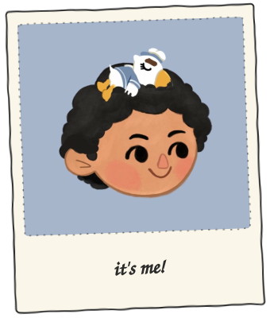
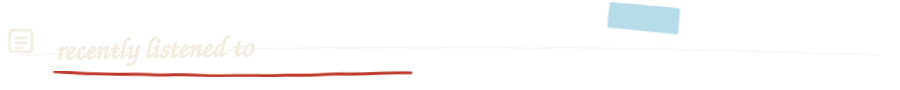

  
Currently a second-year (M2) MAJIC Master's student at the Georges Méliès Campus in Cannes, I'm passionate about video game development. I love imagining, creating, and programming my own projects, whether as part of my studies or in my free time, and I'm always looking to learn something new with every project.
  

**Software**

**Languages**

