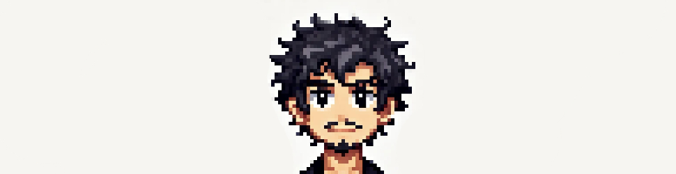

# Salut ! 👋 Moi, c'est Sami  

  

🎓 Au cours de ma formation, j’ai acquis des compétences en **programmation** (Java, C, Programmation Objet), en **développement web** (HTML, CSS, JavaScript, React, NodeJS...) et en **gestion de projets** (AGILE).  

💻 J’ai pu mettre en pratique ces compétences à travers des **projets personnels**, notamment la création de mon **portfolio** ([samisaoud.me](https://samisaoud.me)) et le développement de **jeux vidéo**.  

🚀 Ces expériences m'ont permis de développer des **compétences transversales**, comme l'autonomie, la gestion de projet et le travail en équipe.  

## 🔹 Compétences  
- **Programmation** : Java, C, C#, GDScript, Programmation Objet  
- **Développement Web** : HTML, CSS, JavaScript, React, NodeJS  
- **Développement de Jeux Vidéo** : Godot (GDScript, C#), Unity (C#), Unreal Engine (Blueprints, C++)  
- **Gestion de projet** : Méthodologie AGILE, collaboration  

## 🛠️ Outils  

  
  
  
  
  
  
  
  
  
  
  
  
  

## 📌 À propos de moi  
- 📖 **Actuellement à l'Université de Rennes**, bientôt en master  
- 💻 **Actuellement, je travaille principalement avec React pour le web et GDScript pour le développement de jeux**  

## 📫 Me contacter  

  
  

